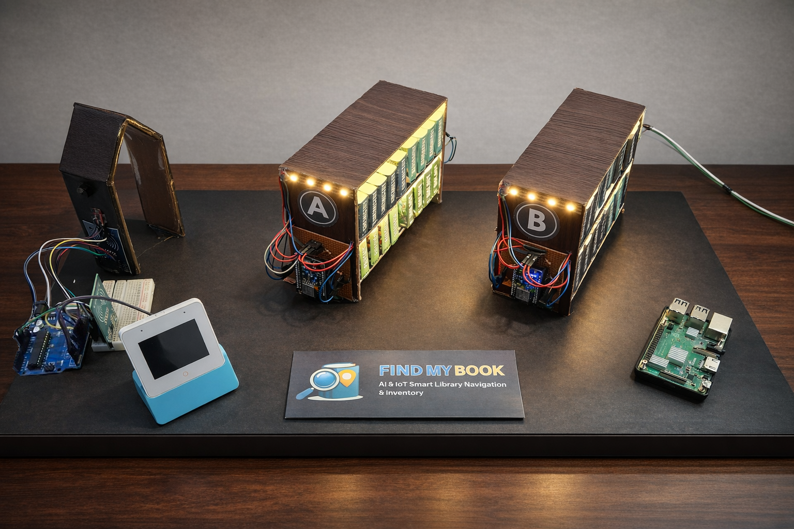
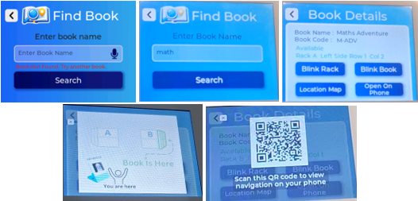
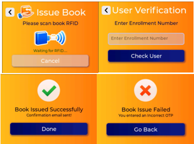
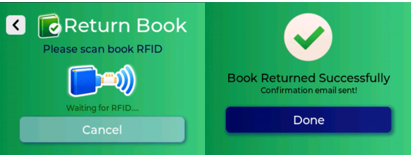
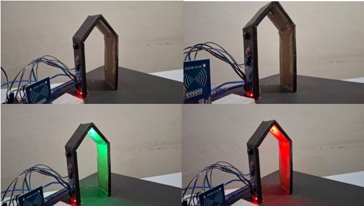
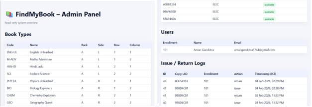
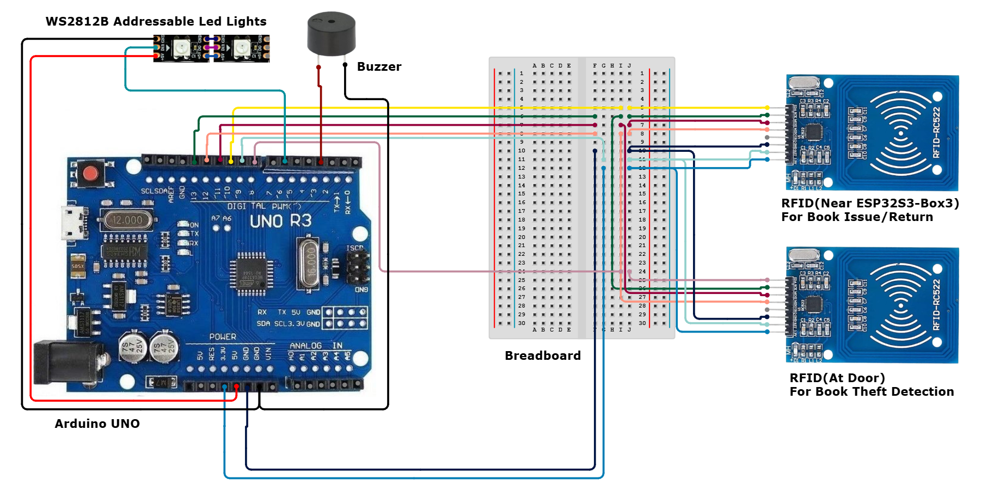

#  Find My Book – AI & IoT Smart Library Navigation & Inventory

An integrated Smart Library System using ESP32-S3 Box, ESP8266, Arduino, and Raspberry Pi for intelligent book search, issuing, returning, and theft detection.

---

## 🚀 Project Overview

**Find My Book** is a complete IoT-based Smart Library solution built with:

- **ESP32-S3 Box 3** as a touchscreen UI interface
- **ESP8266 modules** for rack lighting/navigation
- **Arduino Uno** for RFID-based book issuing/returning and theft detection
- **Raspberry Pi server** (Flask + SQLite) for API management, OTP, and book inventory

The system enables:

- 📖 Book search with live LED guidance
- ✅ OTP-verified book issuing
- 🔁 Book returning via RFID
- 🔒 Anti-theft detection at library exits
- 🌐 Admin web dashboard with live inventory & logs

---

## 🧩 Components Used

| Component               | Quantity |
|------------------------|----------|
| ESP32-S3 Box 3         | 1        |
| ESP8266 Modules        | 2        |
| Arduino Uno            | 1        |
| Raspberry Pi (Server)  | 1        |
| MFRC522 RFID Reader    | 2        |
| WS2812B LED Strip      | As needed|
| Passive Buzzer         | 1        |
| 330Ω Resistors         | 10       |
| 32GB SD Card           | 1        |

---

---

## 🧠 Functional Features

### 🔍 Book Search

- Enter a book name on the ESP32 interface
- Blinks the LED strip on the correct shelf and shows the location map
- QR Code generation to continue search on mobile

### 📦 Issue Book

- Scan RFID
- Enter enrollment number
- Receive OTP on registered email
- Book gets issued upon OTP verification

### 📥 Return Book

- Scan the book RFID
- Marks as returned in DB + email confirmation

### 🚨 Theft Detection

- RFID scanner at exit
- Validates issue status
- If not issued → triggers RED LED + buzzer

### 🖥️ Admin Web Interface

- View book types, book copies, users, and issue logs
- Read-only dashboard hosted on Raspberry Pi

---

## ⚙️ Setup Instructions

### 1. ESP32-S3 Box

- Use [SquareLine Studio](https://squareline.io) to modify UI
- Flash firmware via `idf.py flash`
- Add dependencies and link components properly in CMake

### 2. ESP8266

- Flash `ESP8266.ino` via Arduino IDE
- Device (racka / rackb) sends its IP to Flask server on Wi-Fi connect

### 3. Arduino Uno

- Flash `arduino_rfid.ino` using Arduino IDE
- Connected via Serial to ESP32 Box

### 4. Raspberry Pi (Server)

cd RPI and Database
python -m venv venv
source venv/bin/activate
pip install -r requirements.txt
python seeddatabase.py  # Optional: Populate DB
python app.py           # Run Flask server

---
## Circuit Diagram
### • ESP8266-based Circuit Diagram:

This circuit controls the LED-based shelf navigation system. It uses an ESP8266 module to drive multiple WS2812B LED strips installed on different parts of a bookshelf.
The ESP8266 acts as a smart rack controller. It receives commands over Wi-Fi from the ESP32-S3 Box and lights up specific LED strips based on the book’s location.
Multiple WS2812B LED strips are connected to the ESP8266 to cover:

-	Left side of the rack
-	Right side of the rack
-	Top or glow section of the rack

Each LED strip’s data line is connected through a 330Ω resistor to protect the LEDs and ensure signal stability
### • Arduino Uno Based Circuit Diagram:

This circuit is responsible for book issuing, returning, and theft detection. It uses an Arduino Uno as the main controller along with two RFID readers, a buzzer, and an addressable LED strip. 

Arduino reads RFID tag data, processes it, and communicates the result to the ESP32-S3 Box through serial communication. That data is then further processed by the ESP32-S3 Box and then the required operations takes place.

The RDID near ESP32-S3, will help in issue book and return book only. Once scanned, if the screen is for RFID scan as shown below, then the mentioned task will take place.

Further if RFID at Door is scanned, no matter which screen is open, the ESP32 Box S3 will go through the database and if that book is not issued, then it will alert us with the addressable led lights and buzzer.

---

## 🧪 Database Schema

### 📘 `book_types`

* `book_type_id` (PK)
* `name`, `rack`, `side`, `row`, `column`

### 📗 `book_copies`

* `copy_uid` (PK)
* `book_type_id` (FK)
* `status` ('available', 'issued')

### 📘 `users`

* `enrollment_no` (PK)
* `name`, `email`

### 📘 `issue_logs`

* `id` (PK), `copy_uid`, `enrollment_no`, `action`, `timestamp`

---

## 📬 Credits

**Author:** Aman Gandotra
📧 [amangandotra5744@gmail.com](mailto:amangandotra5744@gmail.com)

---